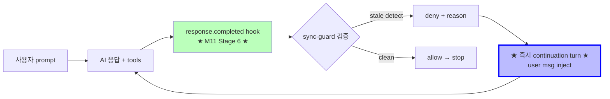

# Lazy-Harness — AI-First Development Framework

> medivance 프로젝트의 사내 framework. Anthropic claude-code / timsquad / oh-my-opencode 영향 받음, 자체 진화.

**현재 상태**: Phase 5b 완료 (lifecycle hooks 진짜 작동) + 5c-1~5c-4 완료 — SSOT detector 통합, 5c-5 진입 직전

## ⚠ Branch 룰 (ADR 0021)

| Branch | `.lazy-harness/` |
|---|---|
| `dev-ian`, `dev`, `main`, `test` | **0 tracked** (절대 commit 안 함) |
| **`experimental/lazy-harness`** | ✅ 모든 framework 작업 |

- `.lazy-harness/` 작업은 **`experimental/lazy-harness` branch 전용**
- 다른 branch 에서 cleanup 시 `git rm --cached` 사용 (disk 유지)
- 미래 별도 repo extract 예정 (framework 의 portability)

## 한 줄 개요

```
AI 와 사람이 같은 framework 위에서 일하면서 서로의 한계를 보완 (Principle 0).
사용자 catch cascade 를 framework 의 self-correcting 안으로 흡수.
```

## 빠른 진입점

| 첫 발은 여기서 | 내용 |
|---|---|
| [`framework/framework-contract.md`](framework/framework-contract.md) | 23 principle + 4 pattern + 5 trigger 강도 — **single source of truth** |
| [`handoff/00-current-state.md`](handoff/00-current-state.md) | 현재 framework 상태 (실시간 갱신) |
| [`decisions/`](decisions/) | 22 ADR (의사결정 영구 기록) |
| [`planning/phase-5-plan.xml`](planning/phase-5-plan.xml) | Phase 5a~5e 계획 + success criteria |
| [`trails/01-long-term-roadmap.xml`](trails/01-long-term-roadmap.xml) | M0~M10 long-term milestones (2027-05 까지) |

## Framework 의 핵심 메커니즘 (ADR 0016)



**Live test 통과 (2026-05-11)**: handoff stale `999` → AI 자동 5 tool calls → `975` Edit → 33초 만에 sync 완료. 사용자 개입 0.

## Phase 진행 상황

| Phase | 상태 | 내용 |
|---|---|---|
| **5a** | ✅ closed (2026-05-10) | Self-Bootstrap (harness init / doctor / update) |
| **5b** | ✅ closed (2026-05-10) | Lifecycle Hooks 진짜 작동 (M11 cascade) |
| **5c** | 🟡 in progress | Code-Trigger Adapters (사용자 발화 + 코드 변경) — ADR 0013/0017 |
| **5d** | 🔵 planned | Interview Loop (양방향 conflict resolution) |
| **5e** | 🔵 planned | 실전 1 회 (medivance 다음 feature 통째로) |

## 디렉토리 구조

```
.lazy-harness/
├── framework/          # framework-contract.md — 23 principle, single source of truth
├── decisions/          # 22 ADRs — 모든 의사결정 영구 기록
├── planning/           # phase-5-plan.xml — sub-phase + criteria
├── trails/             # 01-long-term-roadmap.xml — M0~M10
├── handoff/            # 00-current-state.md — 실시간 상태
├── progress/           # 일별 작업 기록 (2026-05-10.md 등)
│
├── hooks/              # framework hook scripts
│   ├── pre-commit-guard.sh
│   ├── post-commit.sh
│   ├── pre-push.sh
│   ├── weekly-snapshot.sh
│   └── lifecycle/      # ★ M11 lifecycle hooks (ADR 0016) ★
│       ├── on-response-completed.sh  # ★ sync-guard 게이트 ★
│       ├── on-client-disconnect.sh   # session 종료 cleanup
│       └── helpers/
│           ├── check-adr-sync.sh
│           ├── check-handoff-stale.sh
│           └── check-fix-regression.sh
│
├── domain/             # DDD — ubiquitous language + bounded contexts
├── spec/               # SDD — frontend/backend/data/integration/infra/platform
├── behavior/           # BDD — given/when/then scenarios
├── tests/              # TDD — test plan + mapping
├── contracts/          # contract zones (zod/trpc/prisma)
├── ssot/               # SSOT registry — duplicate detection
├── intent/             # Intent Spec (active/archive/templates)
├── prd/                # PRD (optional, large units)
├── regression/         # regression registry + candidates
├── traceability/       # commit ↔ spec mapping
├── questions/          # open questions
├── manifests/          # hook + skill registration
├── visual/             # HTML visualizations
├── generated/          # XML → JSON/MD derived artifacts
├── logs/               # actions / decisions / validations (jsonl)
├── retrospective/      # weekly auto + milestone manual
├── schemas/            # result schema + xml schemas
├── scripts/            # validation scripts (TS-heavy)
├── state/              # runtime state (last-deny.json 등)
└── plans/              # ad-hoc plans (active work)
```

## 23 Principles 요약

| # | Principle | Purpose |
|---|---|---|
| 0 | Human + AI Complementarity | AI 와 사람이 서로 보완 |
| 1.1 | Living Document | 모든 문서가 trigger 로 자라남 |
| 1.2 | Draft + Audit | 갱신마다 gap/conflict/missing/drift/unclear 분석 |
| 1.3 | Single Entry Point (SDD funnel) | 모든 input 이 SDD draft + audit 거침 |
| 1.4 | Domain First | DDD 가 dependency apex |
| 1.5 | Self-Driving Loop | Plan → Act → Verify → Classify → Self-fix |
| 1.6 | Trigger-Based Growth | Trigger 검출 시에만 갱신 |
| 1.7 | Risk Tier + Confidence | 모든 변경 metadata |
| 1.8 | Thin sh + Thick TS | sh 는 wrapper, TS 가 logic |
| 1.9 | Unified Result Schema | 모든 hook/check 동일 JSON |
| 1.10 | Empty-Container Tolerance | 빈 registry 도 valid |
| 17 | Structured Choice Questions | 자유 문답 X, 3~5 option ask |
| 18 | Mandatory ADR | 의사결정 모두 ADR 로 |
| 19 | Wash-out Prevention | live file + init.sh template 동시 갱신 |
| 20 | Plan Status Hygiene | closed phase status 박음 (ADR 0010) |
| 21 | Verification Discipline | L0~L4 strength (ADR 0011) |
| 21.8 | Audit Log Retention Split | actions/decisions 영구, validations rotate |
| 22 | External Dependency Invariant | git/husky/tsc/eslint/ts-morph/python3/bash 만 (ADR 0013) |
| 23 | Code-First Trigger | 사용자 발화 + 코드 변경 = universal trigger (ADR 0013, 0017) |

자세한 내용: [`framework/framework-contract.md`](framework/framework-contract.md)

## Framework self-test (자동 검증)

```bash
$ bun run lazy:test      # primary reproducible gate: doctor smoke + trigger fixtures + negative C17 test
$ bun run lazy:doctor    # full framework doctor: D01~D06
```

ADR 0022: Jcode 는 harness 사용을 위한 tool/wrapper 이고, 검증/운영 로직은 `.lazy-harness/` framework 가 소유한다. 현재 primary gate 는 `lazy:test`이고, framework-owned full doctor 는 `.lazy-harness/scripts/doctor.py` / `bun run lazy:doctor` 이다. Smoke profile 은 XML/JSONL/ADR sequence/docs freshness/branch-hook policy 를 검사하고, full profile 은 D06 C17 external dependency invariant 까지 검사한다.

## 다음 단계 — 5c 진입

| Sub-criterion | 내용 | 상태 |
|---|---|---|
| **5c-1** | ts-morph PoC (DDD term detector) | ✅ **완료 (2026-05-11)** — 8/8 통과 + medivance src/main 138 candidates |
| **5c-2** | SDD contract diff (zod/trpc/prisma) + DDD reference check + acronym handling | ✅ **완료 (2026-05-12)** — 8/8 + 724 candidates + acronym ambiguous (ADR 0019 첫 적용) |
| **5c-3** | BDD scenario (자연어 우선) + DDD/SDD reference check | ✅ **완료 (2026-05-12)** — 자연어 + UI heuristic, fixture 검증 |
| **5c-4** | SSOT duplicate detector | ✅ **완료 (2026-05-12)** — helper/mapper/validator/normalizer/formatter/parser + registry suppression |
| **5c-5** | **Cross-layer consistency map (ADR 0018)** — 4 detector 결과 통합, gap catch | ✅ **완료 (2026-05-12)** — `crossLayer.gaps` + integrated ask + exact fixture 검증 |
| **5c-6** | Lint/typecheck drift | ✅ **완료 (2026-05-12)** — `lint-output.ts` environment/code-drift classifier + fixtures |
| **5c-7** | 구조화 옵션 ask (Principle 17/21) | ✅ **완료 (2026-05-12)** — shared validator + `structuredAskValidation` + `lazy:test` fixture gate |
| 5c-8 | E2E 시연 (4 layer + cross-ref) | 🔵 |
| **5c-9** | Doctor C17 — external SaaS grep | ✅ **완료 (2026-05-12)** — `lazy:doctor` D06 + `lazy:test` negative fixture |

**중요한 architectural decision**: 4 layer detector 는 isolated 가 아니라 **유기적 cross-reference** (ADR 0018). 한 layer 누락이 다른 layer 가 catch.
- BDD scenario 의 'then 자동완성 list' → SDD endpoint 'autocomplete' 누락 발견
- SDD type → DDD term 미등록 발견
- DDD term → BDD scenario 의 noun 으로 사용?

TDD 는 5c 의 detector 아님. **5d Interview Loop 안의 cross-verify gate** (ADR 0019 예정).

## Related Docs

- [`framework/framework-contract.md`](framework/framework-contract.md) — full framework spec
- [`AGENTS.md`](../.jcode/AGENTS.md) — agent entry point
- [`docs/lazy-harness/`](../docs/lazy-harness/) — public-facing docs (if any)

## License

Internal medivance use only. Do not push to public origins.
`.husky/<3 hooks>` 만 framework public surface (ADR 0009).
