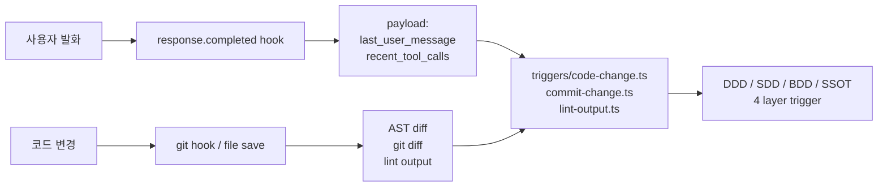

# ADR 0017 — User Input as Universal Trigger (5c-6 External Adapter Removal)

- Status: Accepted
- Date: 2026-05-11
- Trigger: 사용자 catch — "이거 다시한번 계획들이랑 모든걸 정리해보자... 5c-6 이런건 내가 분명히 빼자고 했었는데?? 문서가 제대로 업데이트 안됬나?? 이게 요구사항의 내용이 중요한거지 피그마가 아니고 말로서 대화하면서 설명할수도 있잔아"
- Related: ADR 0013 (External Dependency Invariant + Code-First Trigger), ADR 0016 (Lifecycle Hook Strategy)

## Rule digest

- Status: active
- Layer: ADR
- Scope: framework-global
- Applies when:
  - a feature proposes a channel-specific input adapter (Figma, Slack, etc.) inside framework core
  - deciding how user requirements enter framework triggers
  - handling a Figma URL or natural-language requirement
- Must:
  - treat user conversation in any channel as the universal trigger source
  - read user input from lifecycle payload plus git/AST/lint diff, never by calling external APIs
- Must not:
  - create channel-specific external adapter directories in framework core
  - auto-call external SaaS APIs (e.g. fetch a Figma URL) on detecting input
- Record completion:
  - trigger-source decisions update this ADR; remove stale `triggers/external/*` wording from the framework contract
- Related records:
  - `.lazy-harness/decisions/0013-framework-external-dependency-invariant.md`
  - `.lazy-harness/decisions/0016-lifecycle-hook-strategy.md`
  - `.lazy-harness/decisions/0018-cross-layer-cascade.md`

## Context

ADR 0013 작성 시 사용자 통찰:
> "외부내용이 필요한게 있으면 안되... figma 나 다른것들은 상황에 맞게 하는거지 강제가 아니잔아"

그러나 ADR 0013 cascade 결과:
- `planning/phase-5-plan.xml` 의 5c-6: `triggers/external/ 디렉토리 + opt-in 패턴 — figma.ts 가 FIGMA_PERSONAL_ACCESS_TOKEN 환경변수 있을 때만 활성화`
- ADR 0013 본문의 directory tree: `└── external/ # opt-in (사용자 활성화 시만)`

→ AI 가 사용자 통찰을 부분만 받아들임. "강제 → opt-in" 으로 약화는 했으나 **external 디렉토리 자체는 framework 안에 유지**. 사용자 본 의도는 그게 아님.

## Decision

### 사용자 본 의도 재확인

> "요구사항의 내용이 중요한거지 피그마가 아니고 말로서 대화하면서 설명할 수도 있잔아 안그래?
>  거기에 맞춰서 map 들을 업데이트해야지"

→ **Trigger source = 사용자 conversation 자체** (Figma URL / 자연어 / 말 / 손그림 / 어떤 형태든).
입력 채널은 사용자 자유. Framework 안에 채널별 adapter 디렉토리 만들 필요 0.

### 기술적 매핑 (M11 + ADR 0016 lifecycle hook 활용)

사용자 발화는 이미 `response.completed` hook payload (Stage 5 enriched) 안으로 자연스럽게 잡힘:

```json
{
  "last_user_message": "Figma 의 처방전 화면 만들어줘 (URL: figma.com/file/xyz)",
  "recent_tool_calls": [
    {"name": "WebFetch", "args_preview": "{url: figma.com/file/xyz, ...}"},
    {"name": "Read", "args_preview": "{file_path: /path/to/design.json}"}
  ],
  "turn_count": 1,
  "session_age_seconds": 30
}
```

→ Framework 의 trigger detector 는 이 payload + git diff + AST diff 만 보면 됨. **외부 SaaS API 호출 0**.

### 변경

1. **5c-6 (`triggers/external/` opt-in) 폐기**
2. **5c criteria 재할당**: 옛 5c-7 → 5c-6, 5c-8 → 5c-7, 5c-9 → 5c-8
3. **5c-7 (E2E 시연) 보강**: "사용자 발화 (자연어/Figma URL/말) → response.completed payload → trigger 검증 포함"
4. **ADR 0013 cascade table 갱신**: `triggers/external/*` 흔적 제거
5. **trails/01-long-term-roadmap.xml M3 갱신**: "Adapter Funnel (Figma 우선)" → "Code-Trigger Adapters (사용자 발화 + 코드 변경)"

## 정확한 trigger 검출 경로



→ **사용자 입력 채널 = framework 외부**. Framework 는 jcode payload + git/AST/lint 만 본다.

## Why now

이번 세션 사용자 catch — "5c-6 빼자고 했는데" 직후:
1. ADR 0013 cascade 의 incompleteness 확인
2. 3 문서 (plan / trails / handoff) 모두 stale 상태 확인
3. 명시화 안 하면 다음 세션에서 또 AI 가 잘못 해석 가능

→ **ADR 로 사용자 의도 영구 명시화**. Code-First 와 User-Input-as-Trigger 가 동일 원리임을 분명히.

## Verification

- L0: 파일 작성됨
- L1: 5c criterion 번호 재할당 검증 (5c-1~5c-8, 5c-6 의미 변경)
- L2 marker: ADR 0013 cascade table 안 `triggers/external/*` 흔적 0 확인
- L3 negative: 다음 세션에서 AI 가 "Figma adapter 만들까요?" 같은 잘못된 제안 → 사용자가 ADR 0017 reference 로 거부 가능
- L4 사람 review: 5c-1 진입 전 사용자에게 이 ADR 동의 ask

## Consequences

### Positive

- 사용자 본 의도 영구 명시 (다음 세션 misinterpretation 방지)
- Framework 코어가 진정한 Code-First (Principle 23)
- jcode payload 활용으로 자연스러운 user input 흡수
- 외부 SaaS 의존 0 (Principle 22 더 강하게 enforce)

### Negative

- "Figma 같은 외부 source 를 trigger 로 명시 받고 싶다" 같은 use case 가 있으면 사용자가 자연어로 prompt 해야 함 (직접 framework 안에 등록 없음)
- 단 사용자 통찰에 따르면 이게 의도된 동작

### Risk

- AI 가 "사용자 발화 안 Figma URL detect → WebFetch 자동 호출" 같은 자동화 시도 가능
- → 5c-7 E2E 시연 시 검증 — payload 만 보고 trigger 분석, 직접 API 호출 안 함

## Related Future Work

- 5c-1 ts-morph PoC (DDD term detector)
- 5c-7 E2E 시연 — 사용자 발화 trigger 정확도 측정
- 5c-8 Doctor C17 — framework 코드 안 외부 import grep

## Implementation map

- Status: `needs-review`
- Primary files:
  - `.lazy-harness/hooks/lifecycle/on-response-completed.sh` — response.completed hook entrypoint used for user-message-triggered lifecycle checks.
  - `.lazy-harness/hooks/lifecycle/helpers/check-bdd-trigger.sh` — captures user-flow BDD candidates into `knowledge/candidates.jsonl` without surfacing repeated gates.
  - `.lazy-harness/triggers/code-change.ts` — code/user-message trigger runner for DDD/SDD/BDD/SSOT candidates.
  - `.lazy-harness/scripts/self-test.py` — lifecycle BDD candidate and no-auto-route-telemetry regression coverage.
  - `.lazy-harness/framework/framework-contract.md` — contains stale `triggers/external/*` wording that conflicts with this ADR and must be reviewed before marking verified.
- Key symbols:
  - `runCodeChangeTrigger` (`code-change.ts`) — accepts `lastUserMessage` and routes BDD detection through detector results.
  - `check_bdd_trigger_loop_suppression` and `check_lifecycle_hook_integration` (`self-test.py`) — protect silent BDD candidate capture from user utterances.
  - `check_response_completed_no_auto_route_telemetry` (`self-test.py`) — protects removal of automatic raw user-text route telemetry.
- Flow:
  1. User utterance enters response.completed payload.
  2. BDD helper extracts `last_user_message` and optional edited files.
  3. `code-change.ts --layer bdd` evaluates BDD candidates.
  4. Raw candidates append to `.lazy-harness/knowledge/candidates.jsonl` and canonical record promotion remains user-confirmed.
- Tests / protection:
  - `python3 .lazy-harness/scripts/self-test.py` covers BDD candidate silent capture, lifecycle shadow parity, and no route telemetry from raw text.
  - Keep this map `needs-review` because `.lazy-harness/framework/framework-contract.md` still contains old `triggers/external/*` plugin text.
- Cross-layer links:
  - ADR: `.lazy-harness/decisions/0018-cross-layer-cascade.md`
  - TDD: `.lazy-harness/tests/response-completed-route-telemetry-large-payload.md`
- Machine index:
  - graph ids: `kg_adr0017_user_input_trigger_current`, `kg_adr0017_external_trigger_stale_contract`
  - generated index key: `pending`
