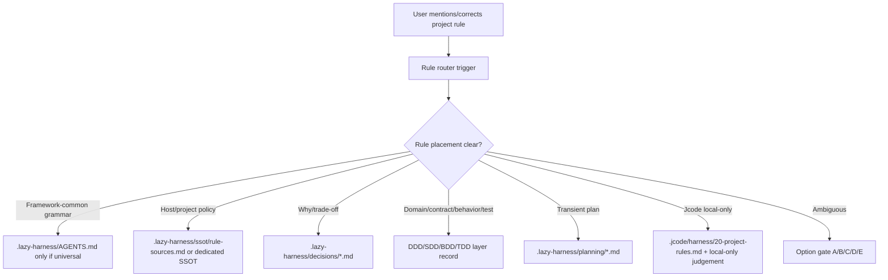

# Project Rule Discovery Router Implementation Plan

Status: proposed
Date: 2026-05-15
Related backlog: `.lazy-harness/planning/project-rule-discovery-router-backlog.md`
Related SSOT: `.lazy-harness/ssot/project-identity.md`
Related ADRs:
- `.lazy-harness/decisions/0024-ai-first-framework-redesign.md`
- `.lazy-harness/decisions/0031-root-bound-record-convergence.md`
- `.lazy-harness/decisions/0034-analysis-discovery-plan-capture-gate.md`

## Goal

Make project-specific rule discovery reliable across lazy-harness hosts.

When an agent encounters a new rule, correction, workflow policy, or “where should this be documented?” question, it should route the rule to the correct durable place instead of defaulting to `.jcode/harness/20-project-rules.md` or leaving the rule only in chat.

## Non-goals

- Do not put host-specific policy into shared `.lazy-harness/AGENTS.md`.
- Do not auto-promote ambiguous user statements into canonical rules without confirmation.
- Do not overwrite user-owned `.jcode` files during sync.
- Do not use sibling repositories as evidence for a host rule.

## Architecture



## Phase 1 — Canonical rule-source SSOT

Create `.lazy-harness/ssot/rule-sources.md`.

Contents:

- Priority order:
  1. Current explicit user request
  2. Private/nested `.jcode` instructions for Jcode-local workflow
  3. `.lazy-harness/ssot/project-identity.md`
  4. `.lazy-harness/ssot/rule-sources.md`
  5. DDD/SDD/BDD/TDD/ADR/SSOT layer records
  6. Shared `.lazy-harness/AGENTS.md` grammar
- Rule placement matrix.
- Examples:
  - PR/worktree tracker policy -> `.lazy-harness/planning` + SSOT/ADR if enduring.
  - “Always check local tracker first” -> project operating SSOT, not `.jcode`, unless only Jcode UI preference.
  - “Use this editor shortcut” -> `.jcode/harness/20-project-rules.md`.
- Implementation map.

Validation:

- Markdown record exists.
- Mentions `.jcode/harness/20-project-rules.md` as local-only, not default.
- Mentions `.lazy-harness` records as project/team rule default.

## Phase 2 — SDD router standard

Create `.lazy-harness/spec/platform/project-rule-router.md`.

Contents:

- Trigger cues:
  - “프로젝트마다 규칙”
  - “규칙 추가”
  - “AGENTS.md 수정?”
  - “.jcode에 넣을까?”
  - “어디에 기록?”
  - “이건 다른 프로젝트마다 다름”
  - user corrections about workflow/source-of-truth/ownership
- Classification table:
  - framework grammar
  - host identity/ownership/source-of-truth
  - project/team operating policy
  - layer fact
  - Jcode-local workflow
  - transient planning
- Required judgement block:

```md
## Rule placement

- Rule: ...
- Scope: framework-global | host-project | team-policy | layer-fact | jcode-local | transient-plan | ambiguous
- Primary record: ...
- Why not AGENTS.md: ...
- Why not `.jcode`: ...
- Confirmation: user-confirmed | inferred-from-record | needs-option-gate
```

- Option gate format.
- Implementation map.

Validation:

- SDD file exists and cross-links SSOT/backlog/ADRs.

## Phase 3 — AGENTS grammar micro-addition

Update `.lazy-harness/AGENTS.md` with one concise sentence under record-as-output or epistemic baseline:

> Project-specific rule/correction 발견 시 `.lazy-harness/ssot/rule-sources.md`를 보고 `.lazy-harness` record vs `.jcode` local-only vs planning 위치를 판정한다. 애매하면 옵션 게이트.

Constraints:

- Keep AGENTS under current self-test cap, currently 180 lines.
- No host-specific examples in AGENTS.

Validation:

- `check_agents_md_invariants` includes `rule-sources` or `Rule placement` phrase.

## Phase 4 — Lifecycle helper

Add `.lazy-harness/hooks/lifecycle/helpers/check-project-rule-placement.sh`.

Behavior:

- Input: `response.completed` payload.
- Detect high-confidence project-rule placement situations.
- Pass if any condition is true:
  - `.lazy-harness/ssot/rule-sources.md` touched.
  - relevant `.lazy-harness/{domain,spec,behavior,tests,decisions,ssot,planning}/...` touched.
  - `.jcode/harness/20-project-rules.md` touched **and** response/file contains `Rule placement` with `jcode-local` or `local-only` judgement.
  - response contains complete `Rule placement` judgement.
- Stop if response says or implies `.jcode` is the location for a project rule without local-only judgement.

Stop options:

A. `.lazy-harness/ssot/...` shared project rule (Recommended)
B. `.lazy-harness/decisions/...` trade-off/why decision
C. `.lazy-harness/planning/...` transient plan/backlog
D. `.jcode/harness/20-project-rules.md` local/private Jcode-only workflow
E. 직접 입력

Validation:

- `bash -n` helper.
- Integrated in `on-response-completed.sh` after analysis discovery capture, before handoff stale.

## Phase 5 — Self-test coverage

Extend `.lazy-harness/scripts/self-test.py`.

Add:

- `run_project_rule_placement_helper(payload)`.
- `check_project_rule_placement_helper()`.

Fixtures:

1. **Block**: response says “프로젝트마다 규칙이 다르니 .jcode에 추가하자” with no Rule placement judgement.
2. **Pass shared**: payload touches `.lazy-harness/ssot/rule-sources.md`.
3. **Pass local**: response includes `Rule placement` and `Scope: jcode-local`.
4. **Pass planning**: payload touches `.lazy-harness/planning/project-rule-...md`.
5. **No false positive**: casual mention of AGENTS or `.jcode` without project-rule language should stay silent.

Update `main()` check list as BOTH so host installs validate it too.

## Phase 6 — Manifest and sync

Update `.lazy-harness/manifests/init-categories.json`:

- Add `ssot/rule-sources.md` if it should sync as framework operating SSOT or seed host copy.
- Add `spec/platform/project-rule-router.md`.
- Ensure helper is already covered by `hooks/lifecycle/helpers/*.sh`.
- If adding ADR, route framework ADR to `framework/operational-adrs/`.

Decision needed:

- Whether `rule-sources.md` is copied as a framework standard SSOT into every host, or seeded as host-editable SSOT. Recommended: seed host-editable SSOT template, because project rule sources are host-specific but structure is framework-defined.

## Phase 7 — Validation and rollout

Run in source repo:

```bash
python3 .lazy-harness/scripts/self-test.py
# reset validations log if observation hook appends
python3 .lazy-harness/scripts/doctor.py --profile smoke
```

Then:

```bash
git commit -m "Add project rule discovery router"
git push origin main
```

Dogfood hosts:

```bash
cd /home/lazydino/dev/medivance
bun ~/dev/lazy-harness/.lazy-harness/scripts/lazy-sync.ts --from ~/dev/lazy-harness --target ~/dev/medivance --force
.lazy-harness/bin/lazy test

cd /home/lazydino/dev/medivance-pwa
bun ~/dev/lazy-harness/.lazy-harness/scripts/lazy-sync.ts --from ~/dev/lazy-harness --target ~/dev/medivance-pwa --force
.lazy-harness/bin/lazy test
```

## Risks and mitigations

| Risk | Mitigation |
|---|---|
| False positives on casual “rules” discussion | Require project-rule cues plus `.jcode`/AGENTS/record placement language. |
| Too much friction when user wants quick local note | Allow `Rule placement: jcode-local` judgement as escape hatch. |
| Host-specific rule accidentally added to shared AGENTS | AGENTS self-test and router standard forbid host examples in AGENTS. |
| `.jcode` user-owned files overwritten | Keep sync policy user-owned, helper only guides, does not overwrite. |
| Ambiguous rule silently recorded in wrong layer | Option gate required when scope is ambiguous. |

## Acceptance criteria

- New project-rule discussions route to `.lazy-harness` by default unless explicitly local-only.
- `.jcode/harness/20-project-rules.md` is used only for Jcode-local/private workflow notes or with explicit local-only judgement.
- Agents have a clear `Rule placement` judgement format.
- Self-test covers block/pass/no-false-positive cases.
- Source repo validation passes.
- medivance and medivance-pwa host validations pass after sync.

## Discovery capture

- DDD: none, no domain/business term introduced.
- SDD: planned `.lazy-harness/spec/platform/project-rule-router.md`.
- BDD: none, not a user-facing product flow.
- TDD: planned self-test helper cases.
- ADR: may be needed if implementation decides seed-vs-sync behavior for `rule-sources.md`.
- SSOT: planned `.lazy-harness/ssot/rule-sources.md`.
- Planning: this implementation plan.

## Implementation map

- Status: `planned`
- Primary files:
  - `.lazy-harness/planning/project-rule-router-implementation-plan.md` — this plan.
  - `.lazy-harness/planning/project-rule-discovery-router-backlog.md` — source backlog.
  - `.lazy-harness/ssot/project-identity.md` — existing split model.
- Key symbols:
  - planned `check_project_rule_placement_helper` in `.lazy-harness/scripts/self-test.py`.
  - planned `check-project-rule-placement.sh` lifecycle helper.
- Flow:
  1. Define canonical rule source registry.
  2. Define SDD router standard and judgement format.
  3. Add concise AGENTS grammar pointer.
  4. Enforce with lifecycle helper and self-tests.
  5. Sync and validate hosts.
- Tests / protection:
  - planned `python3 .lazy-harness/scripts/self-test.py`.
  - planned `python3 .lazy-harness/scripts/doctor.py --profile smoke`.
- Cross-layer links:
  - SSOT: planned `.lazy-harness/ssot/rule-sources.md`.
  - SDD: planned `.lazy-harness/spec/platform/project-rule-router.md`.
  - Planning: `.lazy-harness/planning/project-rule-discovery-router-backlog.md`.
- Machine index:
  - graph ids: `pending`
  - generated index key: `pending until implementation-index generator exists`
